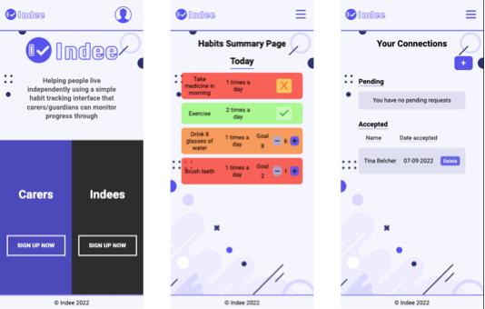

# Indee
Front end deployment (https://indee.netlify.app/)
Back end + database deployment (https://indee-habit-tracker.herokuapp.com/)
Back end GitHub (https://github.com/LaylaSouthcombe/Indee_backend)
## Purpose of the App
A habit tracker that aims to help people live more independently

A simple user interface is presented to Indees, in which they simply need to register whether they have completed their habits for the day

The carer/guardian can then view whether an Indee has completed their habits for the day, and view metrics of their completion rates over the last week, month, and all time

### Features
- Create, edit, update/complete, and delete habits
- View metrics for week, month, and all time
- View summary for the day
- Connect carer/guardian and Indee accounts
- Simple user interface
- More complex functionality solely available to carer/guardian

### Example users

You can view an example of a long-term interaction between two users with the following logins

**Indee**
Email: tinab123@gmail.com
Password: tinab123

**Carer/guardian**
Email: lindab123@gmail.com
Password: lindab123

## Sneak peek

